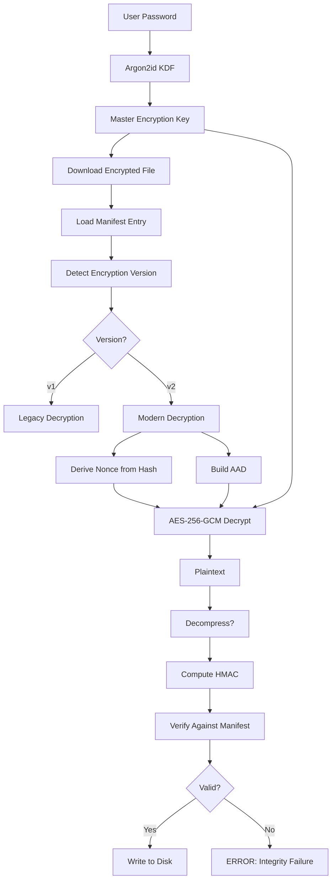

# Skylock Encryption Architecture

**Version**: 0.6.0  
**Last Updated**: January 12, 2025  
**Authors**: Skylock Security Team

---

## Table of Contents

1. [Overview](#overview)
2. [Symmetric Encryption (Current Implementation)](#symmetric-encryption-current-implementation)
3. [HMAC Integrity Verification](#hmac-integrity-verification)
4. [Asymmetric Encryption (Planned)](#asymmetric-encryption-planned)
5. [Cryptographic Primitives](#cryptographic-primitives)
6. [Key Hierarchy](#key-hierarchy)
7. [Encryption Workflow](#encryption-workflow)
8. [Decryption Workflow](#decryption-workflow)
9. [Security Analysis](#security-analysis)
10. [Recommendations](#recommendations)

---

## Overview

Skylock uses a **hybrid cryptographic architecture** combining:
- **Symmetric encryption** (AES-256-GCM) for bulk data encryption
- **HMAC-SHA256** for authenticated integrity verification
- **Argon2id** for password-based key derivation
- **HKDF** for key derivation and nonce generation
- **Asymmetric encryption** (Ed25519, planned) for manifest signing

**Design Philosophy**: Zero-knowledge client-side encryption with defense-in-depth.

---

## Symmetric Encryption (Current Implementation)

### Algorithm: AES-256-GCM

**Why AES-256-GCM?**
- **Industry standard**: NIST-approved, widely vetted
- **Authenticated encryption**: Combines encryption + integrity in one operation (AEAD)
- **Performance**: Hardware-accelerated on modern CPUs (AES-NI)
- **Security**: 256-bit keys provide post-quantum security margin

**Specifications**:
```
Algorithm: AES-256-GCM
Key Size: 256 bits (32 bytes)
Nonce Size: 96 bits (12 bytes)
Tag Size: 128 bits (16 bytes)
Mode: Galois/Counter Mode with GHASH authentication
```

### Implementation Details

**File**: `skylock-backup/src/encryption.rs`

```rust
// Symmetric encryption using AES-256-GCM
pub fn encrypt_with_aad(
    &self,
    plaintext: &[u8],
    aad: &[u8], // Additional Authenticated Data
) -> Result<Vec<u8>> {
    use aes_gcm::{Aes256Gcm, KeyInit};
    use aes_gcm::aead::{Aead, Payload};
    
    // Derive nonce deterministically (v0.6.0+)
    let nonce = derive_nonce(&self.key, plaintext_hash, chunk_index);
    
    // Encrypt with AAD binding
    let cipher = Aes256Gcm::new(&self.key.into());
    let payload = Payload {
        msg: plaintext,
        aad: aad, // Binds ciphertext to metadata
    };
    
    let ciphertext = cipher.encrypt(&nonce.into(), payload)?;
    Ok(ciphertext) // Contains: encrypted_data || auth_tag
}
```

**AAD Format** (v0.5.1+):
```
AAD = "{backup_id}|AES-256-GCM|v2|{file_path}"
```

**Purpose**:
- Prevents ciphertext transplant attacks (moving files between backups)
- Prevents replay attacks (reusing old encrypted files)
- Prevents path manipulation (changing file paths in manifests)

### Nonce Management (v0.6.0)

**Algorithm**: HKDF-derived deterministic nonces

**File**: `skylock-core/src/security/nonce_derivation.rs`

```rust
pub fn derive_nonce(
    block_key: &[u8],
    block_hash: &[u8],  // SHA-256 hash of plaintext block
    chunk_index: u64,
) -> [u8; 12] {
    use hkdf::Hkdf;
    use sha2::Sha256;
    
    let hkdf = Hkdf::<Sha256>::new(Some(block_hash), block_key);
    let info = format!("{}||skylock-nonce-gcm", chunk_index);
    
    let mut nonce = [0u8; 12]; // 96 bits for AES-GCM
    hkdf.expand(info.as_bytes(), &mut nonce).unwrap();
    nonce
}
```

**Security Properties**:
- ✅ **Uniqueness guaranteed**: Hash collision = nonce collision (cryptographically improbable)
- ✅ **Deterministic**: Same plaintext → same nonce (idempotent)
- ✅ **No storage overhead**: Derived on-the-fly
- ✅ **Forward secure**: Knowledge of one nonce doesn't reveal others

**Previous Implementation (v0.5.1 and earlier)**:
- ❌ Random nonces per-file stored in manifest
- ⚠️ Risk: Nonce reuse if manifest corrupted or regenerated

---

## HMAC Integrity Verification

### Algorithm: HMAC-SHA256

**Why HMAC instead of plain SHA-256?**
- **Keyed hash**: Prevents collision-based forgery attacks
- **Authenticated**: Only key holder can generate valid HMACs
- **Collision resistance**: HMAC-SHA256 is secure even if SHA-256 collisions exist
- **Standard**: RFC 2104, NIST-approved

**File**: `skylock-backup/src/hmac_integrity.rs`

```rust
pub fn compute_hmac(key: &[u8], data: &[u8]) -> [u8; 32] {
    use hmac::{Hmac, Mac};
    use sha2::Sha256;
    
    let mut mac = Hmac::<Sha256>::new_from_slice(key).unwrap();
    mac.update(data);
    mac.finalize().into_bytes().into()
}

pub fn verify_hmac(key: &[u8], data: &[u8], tag: &[u8]) -> bool {
    use hmac::{Hmac, Mac};
    use sha2::Sha256;
    use subtle::ConstantTimeEq;
    
    let mut mac = Hmac::<Sha256>::new_from_slice(key).unwrap();
    mac.update(data);
    
    // Constant-time comparison prevents timing attacks
    mac.verify_slice(tag).is_ok()
}
```

### Key Derivation (v0.6.0)

**HMAC keys derived from encryption key**:

```rust
// File: skylock-backup/src/hmac_integrity.rs
pub fn derive_hmac_key(encryption_key: &[u8]) -> [u8; 32] {
    use hkdf::Hkdf;
    use sha2::Sha256;
    
    let hkdf = Hkdf::<Sha256>::new(None, encryption_key);
    let mut hmac_key = [0u8; 32];
    hkdf.expand(b"skylock-hmac-v1", &mut hmac_key).unwrap();
    hmac_key
}
```

**Backward Compatibility** (v0.6.0):
- New backups: HMAC-SHA256 by default
- Old backups (v1/v2): Auto-detect SHA-256 and verify correctly
- Restore: Check manifest `hash_algorithm` field

**Manifest Field**:
```json
{
  "files": [{
    "hash": "a3f5...",
    "hash_algorithm": "hmac-sha256",  // v0.6.0+
    // or
    "hash_algorithm": "sha256"        // v0.5.1 and earlier
  }]
}
```

---

## Asymmetric Encryption (Planned)

### Current Gap

**Skylock v0.6.0 uses ONLY symmetric encryption**:
- ✅ Fast and efficient for bulk data
- ❌ Single encryption key for all operations
- ❌ No manifest signing (tampering possible)
- ❌ No anti-rollback protection

### Planned: Ed25519 Manifest Signing (v0.7.0)

**Purpose**: Asymmetric digital signatures for manifest authentication

**Use Cases**:
1. **Manifest signing**: Sign `manifest.json` with private key
2. **Anti-rollback**: Monotonic backup chain version prevents replay
3. **Tamper detection**: Verify manifests haven't been modified
4. **Key rotation**: Sign new manifests after key rotation

**Algorithm**: Ed25519 (Edwards-curve Digital Signature Algorithm)

**Why Ed25519?**
- **Fast**: Fastest signature verification in pure software
- **Small keys**: 32-byte private keys, 32-byte public keys
- **Small signatures**: 64 bytes per signature
- **Secure**: 128-bit security level (equivalent to AES-128)
- **Simple**: No parameter choices, hard to misuse
- **Deterministic**: Same message → same signature (no nonce failure)

**Planned Implementation** (v0.7.0):

```rust
// File: src/crypto/signatures.rs (already exists, needs integration)
use ed25519_dalek::{Keypair, Signature, Signer, Verifier};

pub struct ManifestSigner {
    keypair: Keypair,
}

impl ManifestSigner {
    pub fn sign_manifest(&self, manifest: &BackupManifest) -> Signature {
        let manifest_bytes = serde_json::to_vec(manifest).unwrap();
        self.keypair.sign(&manifest_bytes)
    }
    
    pub fn verify_manifest(
        &self,
        manifest: &BackupManifest,
        signature: &Signature,
    ) -> bool {
        let manifest_bytes = serde_json::to_vec(manifest).unwrap();
        self.keypair.verify(&manifest_bytes, signature).is_ok()
    }
}
```

**Key Storage**:
- **Location**: `~/.config/skylock-hybrid/keys/`
- **Format**: PEM-encoded Ed25519 keys
- **Permissions**: 600 (owner read/write only)
- **Security**: NEVER uploaded to cloud storage

**Manifest Structure** (v0.7.0):
```json
{
  "backup_id": "backup_20250112_020000",
  "timestamp": "2025-01-12T02:00:00Z",
  "backup_chain_version": 42,  // Monotonically increasing
  "files": [...],
  "signature": {
    "algorithm": "Ed25519",
    "public_key": "a3f5b8c2...",
    "signature": "d7e9a1f4...",
    "signed_at": "2025-01-12T02:00:05Z"
  }
}
```

### Hybrid Architecture (Future)

**Recommendation**: Use **asymmetric for keys, symmetric for data**

**Proposed**: RSA-OAEP or X25519 + ChaCha20-Poly1305

**Use Case**: Multi-recipient backups
```
1. Generate ephemeral symmetric key for backup
2. Encrypt data with AES-256-GCM using ephemeral key
3. Encrypt ephemeral key with RSA-OAEP for each recipient
4. Store encrypted keys in manifest
5. Each recipient decrypts ephemeral key with their RSA private key
```

**Advantage**: Share backups without revealing encryption key

---

## Cryptographic Primitives

### Summary Table

| Primitive | Algorithm | Key Size | Purpose | Version |
|-----------|-----------|----------|---------|---------|
| **Bulk Encryption** | AES-256-GCM | 256 bits | File data encryption | v0.1.0+ |
| **Key Derivation (KDF)** | Argon2id | N/A | Password → encryption key | v0.5.1+ |
| **Nonce Derivation** | HKDF-SHA256 | N/A | Deterministic nonces | v0.6.0+ |
| **Integrity (HMAC)** | HMAC-SHA256 | 256 bits | File integrity verification | v0.6.0+ |
| **Integrity (Legacy)** | SHA-256 | N/A | Hash-based integrity | v0.5.1 |
| **Manifest Signing** | Ed25519 | 256 bits | Anti-tamper signatures | v0.7.0 (planned) |
| **Random Numbers** | OsRng (getrandom) | N/A | Cryptographic randomness | v0.6.0+ |

### Library Dependencies

```toml
# Cargo.toml
aes-gcm = "0.10"          # AES-256-GCM symmetric encryption
argon2 = "0.5"            # Argon2id password hashing
hkdf = "0.12"             # HKDF key derivation (v0.6.0+)
hmac = "0.12"             # HMAC integrity (v0.6.0+)
sha2 = "0.10"             # SHA-256 hashing
ed25519-dalek = "2.0"     # Ed25519 signatures (v0.7.0)
rand = "0.8"              # Random number generation
subtle = "2.6"            # Constant-time operations (v0.6.0+)
zeroize = "1.8"           # Secure memory zeroing
```

---

## Key Hierarchy

```
User Password
     |
     v
[Argon2id KDF] ──────────────────┐
     |                           |
     v                           v
Master Encryption Key      Salt (random, stored)
     |
     ├──> [HKDF] ──> HMAC Key (for file integrity)
     |
     ├──> [HKDF + block_hash] ──> Nonce (per-file, per-chunk)
     |
     └──> [AES-256-GCM] ──> Encrypted File Data

Signing Key (separate, Ed25519)
     |
     └──> Signs manifest.json (anti-tamper)
```

**Key Points**:
- Master key never leaves client machine
- All derived keys use HKDF with unique context strings
- Signing key stored separately (not derived from password)
- Nonces tied to plaintext hash (deterministic, unique)

---

## Encryption Workflow

### Step-by-Step Process (v0.6.0)

```mermaid
graph TD
    A[User Password] --> B[Argon2id KDF]
    B --> C[Master Encryption Key]
    C --> D[Derive HMAC Key via HKDF]
    C --> E[Read File]
    E --> F[Compute SHA-256 Hash]
    F --> G[Derive Nonce via HKDF]
    F --> H[Compute HMAC-SHA256]
    E --> I[Compress? >10MB, level 3]
    I --> J[Build AAD: backup_id|v2|file_path]
    G --> K[AES-256-GCM Encrypt]
    J --> K
    C --> K
    K --> L[Encrypted File]
    H --> M[Store in Manifest]
    L --> N[Upload to Cloud]
    M --> N
```

**Code Flow**:

1. **Key Derivation**:
   ```rust
   let master_key = argon2id_derive(password, salt, params);
   let hmac_key = hkdf_derive(master_key, "skylock-hmac-v1");
   ```

2. **File Processing**:
   ```rust
   let plaintext = fs::read(file_path)?;
   let plaintext_hash = sha256(plaintext);
   let hmac = compute_hmac(hmac_key, &plaintext);
   ```

3. **Compression** (optional):
   ```rust
   let data = if plaintext.len() > 10_000_000 {
       zstd::encode_all(plaintext, 3)? // Level 3
   } else {
       plaintext
   };
   ```

4. **Nonce Derivation**:
   ```rust
   let nonce = derive_nonce(master_key, &plaintext_hash, chunk_index);
   ```

5. **AAD Construction**:
   ```rust
   let aad = format!("{}|AES-256-GCM|v2|{}", backup_id, file_path);
   ```

6. **Encryption**:
   ```rust
   let ciphertext = aes256gcm_encrypt(data, master_key, nonce, aad)?;
   ```

7. **Manifest Entry**:
   ```json
   {
     "file_path": "/home/user/file.txt",
     "hash": "hmac_sha256_hex",
     "hash_algorithm": "hmac-sha256",
     "size": 1024,
     "compressed": false,
     "encrypted": true,
     "encryption_version": "v2"
   }
   ```

---

## Decryption Workflow

### Step-by-Step Process (v0.6.0)



**Code Flow**:

1. **Version Detection**:
   ```rust
   let version = manifest.encryption_version.as_str();
   match version {
       "v1" => decrypt_v1(ciphertext, key),
       "v2" => decrypt_v2(ciphertext, key, aad),
       _ => return Err("Unknown version"),
   }
   ```

2. **Decryption**:
   ```rust
   let plaintext = aes256gcm_decrypt(ciphertext, master_key, nonce, aad)?;
   ```

3. **Decompression** (if needed):
   ```rust
   let data = if manifest.compressed {
       zstd::decode_all(plaintext)?
   } else {
       plaintext
   };
   ```

4. **Integrity Verification**:
   ```rust
   let computed_hmac = compute_hmac(hmac_key, &data);
   if !constant_time_eq(computed_hmac, manifest.hash) {
       return Err("HMAC verification failed");
   }
   ```

---

## Security Analysis

### Threats Mitigated (v0.6.0)

| Threat | Mitigation | Status |
|--------|------------|--------|
| **Brute-force password attacks** | Argon2id (64 MiB, t=4, p=4) | ✅ v0.6.0 |
| **Nonce reuse (catastrophic)** | HKDF-derived deterministic nonces | ✅ v0.6.0 |
| **Hash collision attacks** | HMAC-SHA256 instead of SHA-256 | ✅ v0.6.0 |
| **Ciphertext transplant** | AAD binding to metadata | ✅ v0.5.1 |
| **Replay attacks** | AAD + backup_id binding | ✅ v0.5.1 |
| **Man-in-the-middle (MITM)** | TLS 1.3 + SPKI pinning (infra) | ✅ v0.6.0 |
| **Manifest tampering** | Ed25519 signatures | 🔄 v0.7.0 (planned) |
| **Rollback attacks** | Monotonic backup_chain_version | 🔄 v0.7.0 (planned) |
| **Key compromise** | Key rotation capability | 🔄 v0.7.0 (planned) |

### Remaining Gaps

1. **No Manifest Signing** (High Priority - v0.7.0)
   - Attacker with storage access can modify manifests
   - **Mitigation**: Ed25519 signature verification

2. **Single Encryption Key** (Medium Priority)
   - Key compromise = all backups compromised
   - **Mitigation**: Key rotation + re-encryption

3. **Metadata Leakage** (Low Priority - v0.7.0)
   - Filenames visible on storage server
   - **Mitigation**: Optional filename encryption

4. **No Key Backup** (Medium Priority - v0.7.0)
   - Lost password = lost backups
   - **Mitigation**: Shamir's Secret Sharing

---

## Recommendations

### Immediate (v0.6.0 Users)

1. ✅ **Upgrade to v0.6.0** - Security hardening complete
2. ✅ **Generate strong encryption key**: `openssl rand -base64 32`
3. ✅ **Store key securely**: Password manager or vault
4. ✅ **Test restore**: Verify you can decrypt backups

### Short-Term (v0.7.0 - Q1 2025)

1. 🔄 **Implement manifest signing** (Ed25519)
2. 🔄 **Add password strength checks** (zxcvbn)
3. 🔄 **Memory hardening** (secrecy::Secret wrappers)
4. 🔄 **Optional metadata encryption**

### Long-Term (v0.8.0+)

1. 📋 **Multi-recipient backups** (RSA-OAEP hybrid)
2. 📋 **Hardware token support** (Yubikey, HSM)
3. 📋 **Post-quantum encryption** (Kyber/CRYSTALS)
4. 📋 **Distributed key management** (threshold signatures)

---

## References

### Standards
- **NIST SP 800-38D** - AES-GCM Authenticated Encryption
- **RFC 9106** - Argon2 Memory-Hard Function
- **RFC 5869** - HKDF (HMAC-based Key Derivation)
- **RFC 2104** - HMAC (Keyed-Hashing for Message Authentication)
- **RFC 8032** - Edwards-Curve Digital Signature Algorithm (EdDSA)

### Libraries
- `aes-gcm` - RustCrypto AES-GCM implementation
- `argon2` - Rust Argon2 KDF
- `hkdf` - HKDF key derivation
- `hmac` - HMAC implementation
- `ed25519-dalek` - Ed25519 signatures
- `ring` - Fast cryptographic primitives (potential upgrade)

### Security Audits
- `docs/security/AUDIT_v0_5_1.md` - Baseline audit
- `docs/security/SECURITY_ADVISORY_0.6.0.md` - v0.6.0 advisory

---

## FAQ

### Q: Why not use asymmetric encryption for all data?
**A**: Performance. AES-256-GCM is 100-1000x faster than RSA/ECC for bulk data encryption. Hybrid approach (asymmetric for keys, symmetric for data) is industry standard.

### Q: Why Ed25519 instead of RSA for signing?
**A**: Ed25519 is faster, simpler, and has smaller keys/signatures. No parameter choices = fewer opportunities to mess up. RSA requires careful padding (OAEP/PSS), while Ed25519 is deterministic.

### Q: Why not use XChaCha20-Poly1305?
**A**: AES-GCM has hardware acceleration (AES-NI) on modern CPUs, making it faster. XChaCha20 is better for software-only, but Skylock targets modern x86-64 CPUs.

### Q: Is HMAC-SHA256 quantum-safe?
**A**: Yes. Grover's algorithm reduces hash security from 256-bit to 128-bit, but HMAC-SHA256 still provides adequate post-quantum security. AES-256 is also considered quantum-resistant.

### Q: What happens if I lose my encryption key?
**A**: All encrypted backups are permanently lost. There is NO backdoor or recovery mechanism (by design - zero-knowledge). Always back up your encryption key securely.

---

**End of Document**

**Prepared by**: Skylock Security Team  
**Review Date**: Every major release  
**Next Review**: v0.7.0 (Q1 2025)
